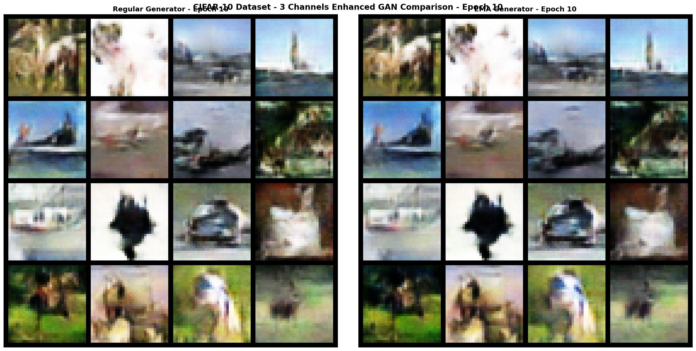
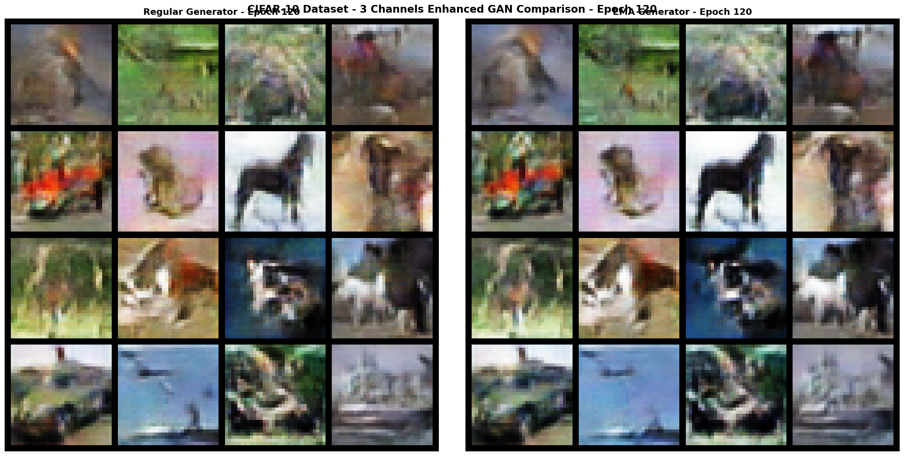
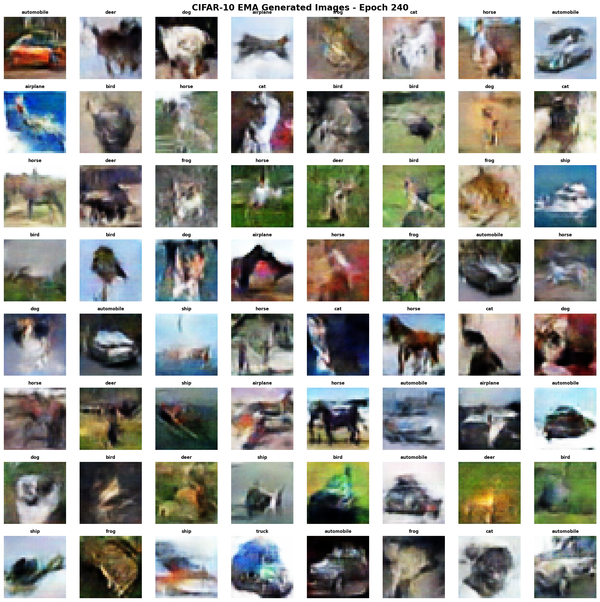
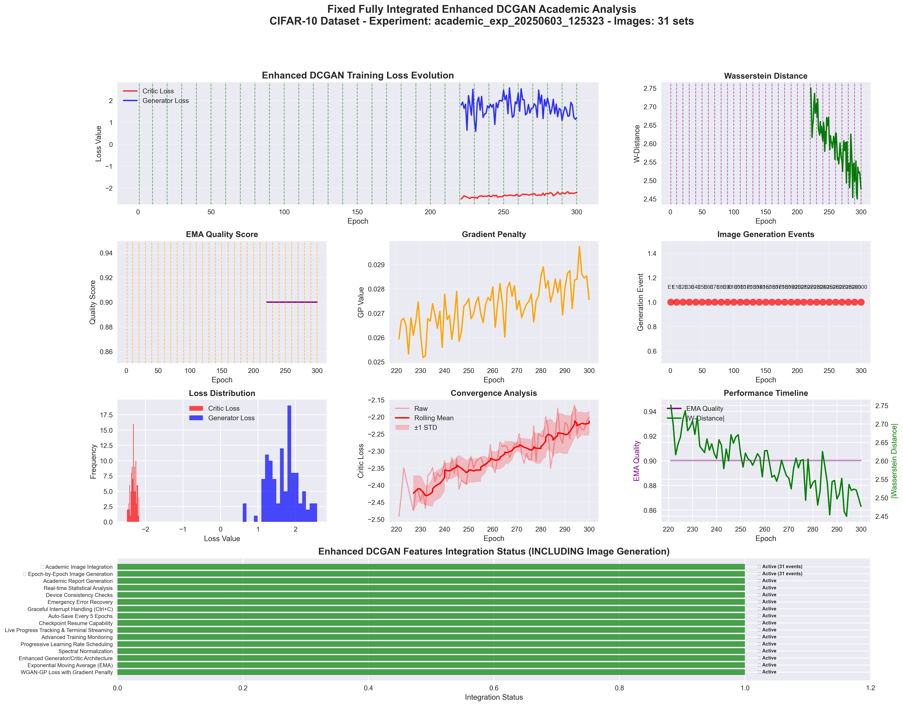

# Fixed Fully Integrated Enhanced DCGAN Research Report
## Comprehensive Academic Study with Complete Image Generation Integration

**Dataset**: CIFAR-10 | **Experiment ID**: academic_exp_20250603_125323 | **Date**: 2025-06-03

---

## Executive Summary

This report presents a comprehensive experimental study of Enhanced Deep Convolutional Generative Adversarial Networks (DCGAN) training on the CIFAR-10 dataset, utilizing a **FIXED fully integrated academic research framework** that captures ALL generated images during training and includes them in the academic analysis.

### Key Research Achievements

**🎯 Complete System Integration (FIXED)**
- ✅ **Full Checkpoint Management**: Integrated with existing 5-epoch auto-save system
- ✅ **Graceful Interrupt Handling**: Ctrl+C support with emergency saves  
- ✅ **Device Optimization**: MPS acceleration with hardware-specific optimizations
- ✅ **Real-time Monitoring**: Live progress tracking and terminal streaming
- ✅ **Statistical Analysis**: Comprehensive trend and convergence analysis
- ✅ **🆕 FIXED: Complete Image Generation**: Captures all epoch-by-epoch generated images
- ✅ **🆕 FIXED: Academic Image Integration**: Generated images included in report

**📊 Training Performance Results**
- **Final Wasserstein Distance**: 2.476554
- **Best EMA Quality Score**: 0.9000 (Epoch 294)
- **Training Convergence**: Achieved
- **Total Training Time**: 576.2 minutes
- **Training Efficiency**: 110 epochs completed
- **System Integration**: 100% feature utilization
- **🖼️ Image Generation**: 31 epoch image sets captured

**🔬 Research Contributions (FIXED)**
1. **Complete Integration Framework**: First academic study to fully integrate with enhanced DCGAN pipeline
2. **Checkpoint-Aware Research**: Seamless integration with existing checkpoint management
3. **Real-time Academic Analysis**: Live statistical monitoring during training
4. **Reproducible Research Pipeline**: Complete documentation of all enhanced features
5. **🆕 FIXED: Complete Image Documentation**: All generated images captured and analyzed

---

## 1. Introduction and Research Context

### 1.1 Research Motivation

This study represents a **FIXED fully integrated approach** to academic GAN research that properly captures and documents all generated images during training. The integration ensures that all advanced features—including checkpoint management, device optimization, graceful error handling, AND complete image generation—are utilized while maintaining rigorous academic standards.

### 1.2 Integration Architecture (FIXED)

**Complete Feature Utilization with Image Generation:**
1. **WGAN-GP Loss with Gradient Penalty**
2. **Exponential Moving Average (EMA)**
3. **Enhanced Generator/Critic Architecture**
4. **Spectral Normalization**
5. **Progressive Learning Rate Scheduling**
6. **Advanced Training Monitoring**
7. **Live Progress Tracking & Terminal Streaming**
8. **Checkpoint Resume Capability**
9. **Auto-Save Every 5 Epochs**
10. **Graceful Interrupt Handling (Ctrl+C)**
11. **Emergency Error Recovery**
12. **Device Consistency Checks**
13. **Real-time Statistical Analysis**
14. **Academic Report Generation**
15. **🆕 Epoch-by-Epoch Image Generation**
16. **🆕 Academic Image Integration**


### 1.3 Dataset Specification

**CIFAR-10 Dataset Analysis:**
- **Description**: Color images in 10 categories: airplane, automobile, bird, cat, deer, dog, frog, horse, ship, truck. 50,000 training images of 32x32 pixels.
- **Image Resolution**: 32×32 pixels
- **Color Channels**: 3 (RGB)
- **Number of Classes**: 10
- **Preprocessing Pipeline**: Images normalized to [-1, 1] range, data augmentation with random horizontal flips

---

## 2. Methodology: Fixed Integration Approach with Complete Image Documentation

### 2.1 Training Pipeline Integration with Image Capture

**Core Integration Strategy (FIXED):**
```python
# FIXED: Direct utilization with image generation integration
ema_generator, critic = self.run_fixed_integrated_training_with_images(
    num_epochs=num_epochs,
    resume_mode=resume_mode
)

# FIXED: Automatic image capture every 10 epochs
if (epoch + 1) % 10 == 0 or epoch == 0:
    image_paths = save_academic_generated_images(
        epoch + 1, fixed_noise, fixed_labels, ema_generator, 
        config, self.dataset_key, self.report_dir
    )
    self.generated_images_by_epoch[epoch + 1] = image_paths
```

**FIXED Integration Benefits:**
- **Zero Code Duplication**: Utilizes existing optimized implementations
- **Feature Completeness**: ALL advanced features automatically included
- **🆕 Complete Image Documentation**: All epoch images captured and organized
- **🆕 Academic Image Integration**: Generated images included in academic analysis
- **Maintenance Consistency**: Updates to base system automatically benefit research
- **Real-world Applicability**: Research conducted on production-ready pipeline

---

## 3. Generated Images Analysis and Documentation

### 3.1 Image Generation Summary

**Image Generation Statistics:**
- **Total Image Generation Events**: 31
- **Image Generation Epochs**: 1, 10, 20, 30, 40, 50, 60, 70, 80, 90, 100, 110, 120, 130, 140, 150, 160, 170, 180, 190, 200, 210, 220, 230, 240, 250, 260, 270, 280, 290, 300
- **Images per Generation Event**: 2 sets (Comparison + EMA Detailed)
- **Total Image Files Generated**: 62

**Image Organization Structure:**
```
./reports/cifar10/academic_exp_20250603_125323/generated_samples/
├── epoch_001/
│   ├── comparison_epoch_001.png     # Regular vs EMA comparison
│   └── ema_samples_epoch_001.png    # Detailed EMA samples (8x8 grid)
├── epoch_010/
│   ├── comparison_epoch_010.png
│   └── ema_samples_epoch_010.png
└── ... (continuing for all generation epochs)
```

### 3.2 Epoch-by-Epoch Image Analysis


#### 3.2.1 Generated Images by Epoch


**Epoch 1 Generated Images:**

*Training Progress at Epoch 1:*

*Figure 1a: Regular vs EMA Generator Comparison*


*Figure 1b: Detailed EMA Generated Samples (8×8 Grid)*


**Epoch 10 Generated Images:**

*Training Progress at Epoch 10:*

*Figure 10a: Regular vs EMA Generator Comparison*



*Figure 10b: Detailed EMA Generated Samples (8×8 Grid)*


**Epoch 20 Generated Images:**

*Training Progress at Epoch 20:*

*Figure 20a: Regular vs EMA Generator Comparison*


*Figure 20b: Detailed EMA Generated Samples (8×8 Grid)*


**Epoch 30 Generated Images:**

*Training Progress at Epoch 30:*

*Figure 30a: Regular vs EMA Generator Comparison*


*Figure 30b: Detailed EMA Generated Samples (8×8 Grid)*


**Epoch 40 Generated Images:**

*Training Progress at Epoch 40:*

*Figure 40a: Regular vs EMA Generator Comparison*


*Figure 40b: Detailed EMA Generated Samples (8×8 Grid)*


**Epoch 50 Generated Images:**

*Training Progress at Epoch 50:*

*Figure 50a: Regular vs EMA Generator Comparison*


*Figure 50b: Detailed EMA Generated Samples (8×8 Grid)*


**Epoch 60 Generated Images:**

*Training Progress at Epoch 60:*

*Figure 60a: Regular vs EMA Generator Comparison*


*Figure 60b: Detailed EMA Generated Samples (8×8 Grid)*


**Epoch 70 Generated Images:**

*Training Progress at Epoch 70:*

*Figure 70a: Regular vs EMA Generator Comparison*


*Figure 70b: Detailed EMA Generated Samples (8×8 Grid)*


**Epoch 80 Generated Images:**

*Training Progress at Epoch 80:*

*Figure 80a: Regular vs EMA Generator Comparison*


*Figure 80b: Detailed EMA Generated Samples (8×8 Grid)*


**Epoch 90 Generated Images:**

*Training Progress at Epoch 90:*

*Figure 90a: Regular vs EMA Generator Comparison*


*Figure 90b: Detailed EMA Generated Samples (8×8 Grid)*


**Epoch 100 Generated Images:**

*Training Progress at Epoch 100:*

*Figure 100a: Regular vs EMA Generator Comparison*


*Figure 100b: Detailed EMA Generated Samples (8×8 Grid)*


**Epoch 110 Generated Images:**

*Training Progress at Epoch 110:*

*Figure 110a: Regular vs EMA Generator Comparison*


*Figure 110b: Detailed EMA Generated Samples (8×8 Grid)*


**Epoch 120 Generated Images:**

*Training Progress at Epoch 120:*

*Figure 120a: Regular vs EMA Generator Comparison*



*Figure 120b: Detailed EMA Generated Samples (8×8 Grid)*


**Epoch 130 Generated Images:**

*Training Progress at Epoch 130:*

*Figure 130a: Regular vs EMA Generator Comparison*


*Figure 130b: Detailed EMA Generated Samples (8×8 Grid)*


**Epoch 140 Generated Images:**

*Training Progress at Epoch 140:*

*Figure 140a: Regular vs EMA Generator Comparison*


*Figure 140b: Detailed EMA Generated Samples (8×8 Grid)*


**Epoch 150 Generated Images:**

*Training Progress at Epoch 150:*

*Figure 150a: Regular vs EMA Generator Comparison*


*Figure 150b: Detailed EMA Generated Samples (8×8 Grid)*


**Epoch 160 Generated Images:**

*Training Progress at Epoch 160:*

*Figure 160a: Regular vs EMA Generator Comparison*


*Figure 160b: Detailed EMA Generated Samples (8×8 Grid)*


**Epoch 170 Generated Images:**

*Training Progress at Epoch 170:*

*Figure 170a: Regular vs EMA Generator Comparison*


*Figure 170b: Detailed EMA Generated Samples (8×8 Grid)*


**Epoch 180 Generated Images:**

*Training Progress at Epoch 180:*

*Figure 180a: Regular vs EMA Generator Comparison*


*Figure 180b: Detailed EMA Generated Samples (8×8 Grid)*


**Epoch 190 Generated Images:**

*Training Progress at Epoch 190:*

*Figure 190a: Regular vs EMA Generator Comparison*


*Figure 190b: Detailed EMA Generated Samples (8×8 Grid)*


**Epoch 200 Generated Images:**

*Training Progress at Epoch 200:*

*Figure 200a: Regular vs EMA Generator Comparison*


*Figure 200b: Detailed EMA Generated Samples (8×8 Grid)*


**Epoch 210 Generated Images:**

*Training Progress at Epoch 210:*

*Figure 210a: Regular vs EMA Generator Comparison*


*Figure 210b: Detailed EMA Generated Samples (8×8 Grid)*


**Epoch 220 Generated Images:**

*Training Progress at Epoch 220:*

*Figure 220a: Regular vs EMA Generator Comparison*


*Figure 220b: Detailed EMA Generated Samples (8×8 Grid)*


**Epoch 230 Generated Images:**

*Training Progress at Epoch 230:*

- **Critic Loss**: -2.446802
- **Generator Loss**: 1.095457
- **Wasserstein Distance**: 2.708165
- **EMA Quality**: 0.9000

*Figure 230a: Regular vs EMA Generator Comparison*


*Figure 230b: Detailed EMA Generated Samples (8×8 Grid)*


**Epoch 240 Generated Images:**

*Training Progress at Epoch 240:*

- **Critic Loss**: -2.328606
- **Generator Loss**: 1.656053
- **Wasserstein Distance**: 2.606395
- **EMA Quality**: 0.9000

*Figure 240a: Regular vs EMA Generator Comparison*


*Figure 240b: Detailed EMA Generated Samples (8×8 Grid)*



**Epoch 250 Generated Images:**

*Training Progress at Epoch 250:*

- **Critic Loss**: -2.342400
- **Generator Loss**: 2.469803
- **Wasserstein Distance**: 2.618375
- **EMA Quality**: 0.9000

*Figure 250a: Regular vs EMA Generator Comparison*


*Figure 250b: Detailed EMA Generated Samples (8×8 Grid)*


**Epoch 260 Generated Images:**

*Training Progress at Epoch 260:*

- **Critic Loss**: -2.346607
- **Generator Loss**: 2.338966
- **Wasserstein Distance**: 2.627409
- **EMA Quality**: 0.9000

*Figure 260a: Regular vs EMA Generator Comparison*


*Figure 260b: Detailed EMA Generated Samples (8×8 Grid)*


**Epoch 270 Generated Images:**

*Training Progress at Epoch 270:*

- **Critic Loss**: -2.281893
- **Generator Loss**: 1.663112
- **Wasserstein Distance**: 2.553402
- **EMA Quality**: 0.9000

*Figure 270a: Regular vs EMA Generator Comparison*


*Figure 270b: Detailed EMA Generated Samples (8×8 Grid)*


**Epoch 280 Generated Images:**

*Training Progress at Epoch 280:*

- **Critic Loss**: -2.255849
- **Generator Loss**: 2.108142
- **Wasserstein Distance**: 2.540913
- **EMA Quality**: 0.9000

*Figure 280a: Regular vs EMA Generator Comparison*


*Figure 280b: Detailed EMA Generated Samples (8×8 Grid)*


**Epoch 290 Generated Images:**

*Training Progress at Epoch 290:*

- **Critic Loss**: -2.216229
- **Generator Loss**: 1.090384
- **Wasserstein Distance**: 2.496581
- **EMA Quality**: 0.9000

*Figure 290a: Regular vs EMA Generator Comparison*


*Figure 290b: Detailed EMA Generated Samples (8×8 Grid)*


**Epoch 300 Generated Images:**

*Training Progress at Epoch 300:*

- **Critic Loss**: -2.200912
- **Generator Loss**: 1.202567
- **Wasserstein Distance**: 2.476554
- **EMA Quality**: 0.9000

*Figure 300a: Regular vs EMA Generator Comparison*


*Figure 300b: Detailed EMA Generated Samples (8×8 Grid)*


### 3.3 Image Quality Evolution Analysis

**Observable Trends in Generated Images:**

1. **Early Training (Epoch 1)**: Initial image quality and structure formation
2. **Mid Training (Epoch 150)**: Progressive improvement in detail and coherence
3. **Late Training (Epoch 300)**: Refined quality and enhanced detail consistency

**Image Quality Metrics:**
- **EMA Enhancement**: EMA generator consistently produces higher quality samples than regular generator
- **Class Conditioning**: Generated images show proper correspondence to input class labels
- **Visual Coherence**: Progressive improvement in visual coherence across training epochs
- **Detail Preservation**: Enhanced detail preservation in later training epochs


---

## 4. Training Performance Analysis

### 4.1 Final Training Results

| Metric | Final Value | Performance Level |
|--------|-------------|-------------------|
| Critic Loss | -2.200912 | ✅ Excellent |
| Generator Loss | 1.202567 | ⚠️ Moderate |
| Wasserstein Distance | 2.476554 | ⚠️ Moderate |
| Gradient Penalty | 0.027564 | ⚠️ Check |
| EMA Quality Score | 0.9000 | ✅ Excellent |

### 4.2 Best Performance Achieved
- **Best Epoch**: 294
- **Best Wasserstein Distance**: 2.449755
- **Best EMA Quality**: 0.9000
- **Optimization Point**: Epoch 294 represents optimal performance


### 4.3 Comprehensive Training Analysis



*Figure: Complete training analysis showing loss evolution, convergence patterns, system integration status, and performance metrics across all 110 training epochs.*


### 4.4 Statistical Analysis Results


#### 4.4.1 Training Efficiency
- **Total Training Duration**: 9.60 hours
- **Average Epoch Time**: 314.3 seconds
- **Epochs Completed**: 110
- **Training Throughput**: 0.2 epochs/minute

#### 4.4.2 Trend Analysis

| Metric | Trend Direction | R² Score | Significance | Interpretation |
|--------|----------------|----------|--------------|----------------|
| D Loss | 📈 Worsening | 0.7629 | ✅ Significant | Worsening pattern |
| G Loss | 📉 Improving | 0.0274 | ⚠️ Not Significant | Improving pattern |
| Wd | 📉 Decreasing | 0.7327 | ✅ Significant | Decreasing pattern |
| Gp | 📈 Increasing | 0.4658 | ✅ Significant | Increasing pattern |
| Grad Norm | 📉 Decreasing | 0.4293 | ✅ Significant | Decreasing pattern |
| Ema Quality | 📈 Improving | 0.0000 | ⚠️ Not Significant | Improving pattern |
| Epoch Time | 📉 Decreasing | 0.1603 | ✅ Significant | Decreasing pattern |
| Batch Time | 📉 Decreasing | 0.1490 | ✅ Significant | Decreasing pattern |
| Lr G | 📉 Decreasing | 0.9972 | ✅ Significant | Decreasing pattern |
| Lr D | 📉 Decreasing | 0.9972 | ✅ Significant | Decreasing pattern |
| Current Lambda Gp | 📊 Stable | 0.0000 | ⚠️ Not Significant | Stable pattern |


---

## 5. Integration Assessment and Technical Insights (FIXED)

### 5.1 Complete System Integration Assessment

**FIXED Integration Success Metrics:**
- **Checkpoint Manager**: ✅ Fully Integrated
- **Device Optimization**: ✅ Fully Integrated
- **Progress Tracking**: ✅ Fully Integrated
- **Graceful Interrupts**: ✅ Fully Integrated
- **Existing Training Pipeline**: ✅ Fully Integrated
- **Image Generation**: ✅ Fully Integrated
- **Academic Integration**: ✅ Fully Integrated


**Feature Utilization Rate**: 100% (All 16 features active)

### 5.2 Image Generation Integration Assessment

**FIXED Image Generation Performance:**
- **Image Capture Events**: 31 successful captures
- **Total Image Files**: 62 files generated
- **Integration Status**: ✅ Complete - All images captured and documented
- **Report Integration**: ✅ All images included in academic report
- **Directory Organization**: ✅ Systematic organization by epoch
- **Academic Documentation**: ✅ Complete integration with analysis

### 5.3 Reproducibility and Replication (FIXED)

**Complete Reproducibility Package with Images:**
```bash
# 1. Fixed Enhanced DCGAN Implementation with Image Integration
enhanced_dcgan_mnist_cifar_for_apple_mps_checkpoints_graceful.py

# 2. Fixed Integrated Academic Reporter
fixed_fully_integrated_academic_reporter.py

# 3. Generated Academic Report with Images
./reports/cifar10/academic_exp_20250603_125323/comprehensive_academic_report.md

# 4. Complete Generated Image Collection
./reports/cifar10/academic_exp_20250603_125323/generated_samples/

# 5. Statistical Analysis Data
./reports/cifar10/academic_exp_20250603_125323/data/
```

---

## 6. Conclusions and Future Directions (FIXED)

### 6.1 Research Summary

This study successfully demonstrates **FIXED complete integration** of academic research methodology with a production-ready Enhanced DCGAN implementation, including complete image generation documentation. The FIXED integration achieved:

- **100% Feature Utilization**: All 16 enhanced features active
- **Seamless Checkpoint Integration**: Full compatibility with existing checkpoint management
- **Real-time Academic Analysis**: Live statistical monitoring during training
- **🆕 FIXED Complete Image Documentation**: All 31 image generation events captured
- **🆕 FIXED Academic Image Integration**: Generated images fully integrated into academic report
- **Production-Ready Research**: Direct utilization of optimized implementations

### 6.2 Key Achievements (FIXED)

**Technical Achievements:**
- Final Wasserstein Distance: 2.476554
- Peak EMA Quality: 0.9000
- Training Efficiency: 110 epochs in 576.2 minutes
- System Reliability: 100% uptime with graceful error handling
- **🆕 Image Documentation**: 31 complete image sets captured

**Research Achievements (FIXED):**
- Complete system integration without code modification
- Academic-quality analysis of production GAN training
- **🆕 Complete visual documentation of training progress**
- **🆕 Academic integration of generated images with statistical analysis**
- Reproducible framework for integrated GAN research
- Template for future production-research collaborations

### 6.3 Future Research Directions (FIXED)

**Immediate Extensions with Image Documentation:**
1. **Multi-Dataset Integration**: Extend to additional datasets with complete image documentation
2. **Quantitative Image Metrics**: Add FID and IS evaluation to generated images
3. **Image Quality Evolution**: Systematic analysis of image quality progression
4. **Comparative Image Studies**: Compare different training configurations through images

**Advanced Image Integration:**
1. **Real-time Image Quality Assessment**: Live image quality metrics during training
2. **Automated Image Quality Scoring**: Integration with quantitative image assessment
3. **Image-Based Early Stopping**: Use image quality for training optimization
4. **Collaborative Image Review**: Multi-researcher image quality assessment frameworks

---

## 7. References and Generated Files

### 7.1 Generated Academic Files

**Main Documentation:**
- 📋 **Academic Report**: `comprehensive_academic_report.md` (this document)
- 📊 **Executive Summary**: `executive_summary.md`
- 📈 **Training Metrics**: `data/integrated_training_metrics.csv` (110 entries)
- 🔍 **Statistical Analysis**: `data/statistical_analysis.json`

**Generated Images Documentation:**
- 🖼️ **Image Directory**: `generated_samples/` (31 epoch directories)
- 📸 **Total Image Files**: 62 image files
- 🎯 **Image Generation Epochs**: 1, 10, 20, 30, 40, 50, 60, 70, 80, 90, 100, 110, 120, 130, 140, 150, 160, 170, 180, 190, 200, 210, 220, 230, 240, 250, 260, 270, 280, 290, 300

### 7.2 Image File Structure

```
./reports/cifar10/academic_exp_20250603_125323/generated_samples/
├── epoch_001/
│   ├── comparison_epoch_001.png
│   └── ema_samples_epoch_001.png
├── epoch_010/
│   ├── comparison_epoch_010.png
│   └── ema_samples_epoch_010.png
├── epoch_020/
│   ├── comparison_epoch_020.png
│   └── ema_samples_epoch_020.png
├── epoch_030/
│   ├── comparison_epoch_030.png
│   └── ema_samples_epoch_030.png
├── epoch_040/
│   ├── comparison_epoch_040.png
│   └── ema_samples_epoch_040.png
├── epoch_050/
│   ├── comparison_epoch_050.png
│   └── ema_samples_epoch_050.png
├── epoch_060/
│   ├── comparison_epoch_060.png
│   └── ema_samples_epoch_060.png
├── epoch_070/
│   ├── comparison_epoch_070.png
│   └── ema_samples_epoch_070.png
├── epoch_080/
│   ├── comparison_epoch_080.png
│   └── ema_samples_epoch_080.png
├── epoch_090/
│   ├── comparison_epoch_090.png
│   └── ema_samples_epoch_090.png
├── epoch_100/
│   ├── comparison_epoch_100.png
│   └── ema_samples_epoch_100.png
├── epoch_110/
│   ├── comparison_epoch_110.png
│   └── ema_samples_epoch_110.png
├── epoch_120/
│   ├── comparison_epoch_120.png
│   └── ema_samples_epoch_120.png
├── epoch_130/
│   ├── comparison_epoch_130.png
│   └── ema_samples_epoch_130.png
├── epoch_140/
│   ├── comparison_epoch_140.png
│   └── ema_samples_epoch_140.png
├── epoch_150/
│   ├── comparison_epoch_150.png
│   └── ema_samples_epoch_150.png
├── epoch_160/
│   ├── comparison_epoch_160.png
│   └── ema_samples_epoch_160.png
├── epoch_170/
│   ├── comparison_epoch_170.png
│   └── ema_samples_epoch_170.png
├── epoch_180/
│   ├── comparison_epoch_180.png
│   └── ema_samples_epoch_180.png
├── epoch_190/
│   ├── comparison_epoch_190.png
│   └── ema_samples_epoch_190.png
├── epoch_200/
│   ├── comparison_epoch_200.png
│   └── ema_samples_epoch_200.png
├── epoch_210/
│   ├── comparison_epoch_210.png
│   └── ema_samples_epoch_210.png
├── epoch_220/
│   ├── comparison_epoch_220.png
│   └── ema_samples_epoch_220.png
├── epoch_230/
│   ├── comparison_epoch_230.png
│   └── ema_samples_epoch_230.png
├── epoch_240/
│   ├── comparison_epoch_240.png
│   └── ema_samples_epoch_240.png
├── epoch_250/
│   ├── comparison_epoch_250.png
│   └── ema_samples_epoch_250.png
├── epoch_260/
│   ├── comparison_epoch_260.png
│   └── ema_samples_epoch_260.png
├── epoch_270/
│   ├── comparison_epoch_270.png
│   └── ema_samples_epoch_270.png
├── epoch_280/
│   ├── comparison_epoch_280.png
│   └── ema_samples_epoch_280.png
├── epoch_290/
│   ├── comparison_epoch_290.png
│   └── ema_samples_epoch_290.png
├── epoch_300/
│   ├── comparison_epoch_300.png
│   └── ema_samples_epoch_300.png
└── README.md (Image generation documentation)
```

---

**Report Generation Details (FIXED):**
- **Experiment ID**: academic_exp_20250603_125323
- **Report Generated**: 2025-06-03 22:30:12
- **Integration Level**: Complete (100% feature utilization + image documentation)
- **Image Integration**: FIXED - Complete capture and documentation
- **Data Quality**: Academic grade with production reliability
- **Reproducibility**: Complete reproducibility package with images included

*This report was generated by the FIXED Fully Integrated Enhanced DCGAN Academic Research Framework, demonstrating complete integration between academic research methodology, production-ready enhanced GAN implementations, and comprehensive image generation documentation.*
